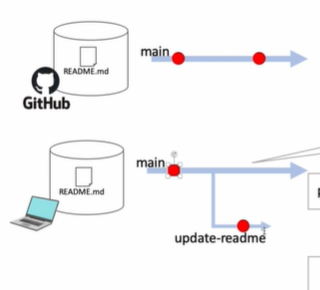

Gitとは
バージョン管理システムの一つ
特定のバージョンとの差分を確認したり、あるバージョンに戻すことができる

名前を変えて繰り返しファイルを保存したりしますが、
最終版などと名前をつけてからさらに更新し続けてどれが最新版なのかわからなくなってしまったりする

プロジェクトのによっては多くのファイルが作成される。
ファイルが多い状況でどれが最新版なのかわからなくなってしまうと混乱する

Gitを使うとどれが最新のファイルなのか簡単にわかる
前のバージョンに戻すこともできる
他の人が行った変更と自分の行った変更を統合することができる

チームでコードを管理する際には非常に便利なツールになる

分散管理方式

集中管理方式と分散管理方式がある
Gitは分散管理方式であり、各メンバーのローカルのパソノンに中央のリポジトリのコピーを持っており、
自分のローカルのリポジトリの中でバージョン管理をする
また、中央に一つの共有するリポジトリをおいてメンバー間の中央管理を行う

全体的な流れ
リポジトリをコピーしてローカルリポジトリを作成する
ブランチを作成する
ファイルを更新、コミットする
ローカルリポジトリをリモートリポジトリに反映する
新ブランチをmainブランチにマージする
リモートリポジトリをローカルリポジトリに反映する
不要なブランチを削除する

.gitファイルの中身について
git config --global <attribute> <value>
でGitユーザの設定をする
git config --global user.name "username"
git config --global user.email "email"

git clone <remote_repo_url>

git remote -v

ブランチの作成
基本的にメインブランチ上で直接コードをいじることはしない
新しいブランチを切ってそのブランチ上で作業を行う
メインのコード上には影響がなく作業することができる

作業用のブランチを作成
ブランチ一覧を表示
作業するブランチを切り替える

main: デフォルトのブランチ
すべての開発は最終的にmainブランチに合流する
リリースするコード

ブランチをきる
どの単位でブランチを作成するかはチームや個人それぞれ
機能ごとにブランチを作成することが多い
ブランチを作成することで並行作業や複数人での作業がやりやすくなる

ブランチ一覧の表示

新しいブランチを切る
作業内容がわかりやすい名前にする
長すぎない用意する
単語をつなげる場合はハイフンでつなげる

ブランチを切り替える

Gitは作業履歴をコミットたんいでかんりする
変更をコミットするには一度Staging areaに挙げる
ローカルリポジトリにコミットする

作業状態を確認する
git branch

ステージングエリアに追加する
git add <filename>

ステージングエリアの内容をローカルリポジトリにコミットする
git commit -m "commit message"
必ずコミットメッセージをつける
基本的に一分でどういう変更をしたかがわかるようにする
コミット後にはコミットポイントが作られる

コミットの履歴を見る
git log
コミットのポイントとコミットメッセージが表示される

リモートリポジトリにローカルリポジトリに更新する

pushする前にリモートリポジトリの更新をローカルリポジトリに反映する
git pull <remote_ref> <branchname>
git push <remote_ref> <branchname>

pushしたブランチをmainブランチにマージする
pull request を出す
リモートリポジトリはチームで共有するリポジトリなので事由にマージすることはできない
原則ほかのメンバーが自分が出したpull requestを確認してマージする
マージはリモートリポジトリのブラウザで行う

ローカルリポジトリにリモートリポジトリの変更を反映する
ローカルでマージすることで反映するのではなく、リモートリポジトリからpullすることによって反映させる

ローカルの不要なブランチを削除する

既存のディレクトリをGitリポジトリにする
git init
.gitファイルがgitリポジトリである証拠

新規ファイルがgitからtrackされていないことを確認する

unstageする
git reset <filename>

working directoryの変更内容を破棄する
git checkout -- <filename>

.gitignore

差分を表示する

working directoryとstaging areaのdiff
git diff

working directory とリポジトリとのdiff
git diff HEAD

staging areaとリポジトリのdiff
git diff --staged HEAD

特定のファイルのdiffを確認する
git diff -- <filename>

指定したコミット同士のdiffを確認する
git diff <commitID> <commitID>

ブランチ同士のdiffを確認する
git diff origin/main main

git config --global --replace-all core.pager "less -F-X"

リモートリポジトリがどこに設定されているかの確認ができる
git remote -v

ブランチの作成
作業用のブランチを作成する
git branch [branch-name]
git switch -c [branch-name]

gitは作業履歴をコミット単位で管理する
変更内容をまとめて袋に入れて(add)からコミットするイメージ

リモートリポジトリにローカルリポジトリの内容を反映する　push
push前に一度リモートリポの内容をローカルリポに反映する
なぜなら自分が作業を行っている間にリモートリポが他の人が更新しているかもしれないから
git pull origin main
git push origin feature

pushした内容をリモートリポジトリでプルリクエストを出す
どのブランチからどのブランチへマージするのかを選択する
main <- feature

プルリクエストは基本的に出した人以外が承認する

ローカルリポジトリにリモートリポジトリの内容を反映する
ローカルリポジトリでmainブランチに移動する
リモートリポジトリのmainブランチの情報をローカルリポジトリのmainブランチにpullする

ローカルリポジトリは基本的に最新のリモートリポジトリと同じ状態にしておくのが望ましい

git checkout main
git pull origin main

不要になったブランチを削除する
ローカルリポジトリの不要なブランチを削除する
git branch -D [branch-name]
ブラウザでリモートリポジトリの不要なブランチを削除する

gitがtrackしているファイルがわかる
git ls-files

working directoryの変更を破棄する

git mvと通常の名前変更した場合の違い

git rm 名前変更として扱われる
通常の名前変更 旧ファイル削除　新ファイル作成という扱い

sublimeをデフォルトのエディタに設定する
git config --global core.editor "subl -n -w"

マージのパターン

Fast forward
マージする際に何も障害となるコミットがない場合

Fast forwardでない場合
マージコミットが作成される

    Automatic merge
        同じ個所を変更していない場合、Gitが自動的にマージしてくれる
        
    Conflict
        同じ個所を変更している場合Gitがどちらを採用すべきか判断ができない→自分で対処する必要がある

コンフリクトを起こさないようにするには？
* 同じファイルを複数人で変更しない
* 同じファイルを変更する場合には、チームでコミュニケーションを取っておく

コンフリクトは悪いことではなく、起こってしまうもの

